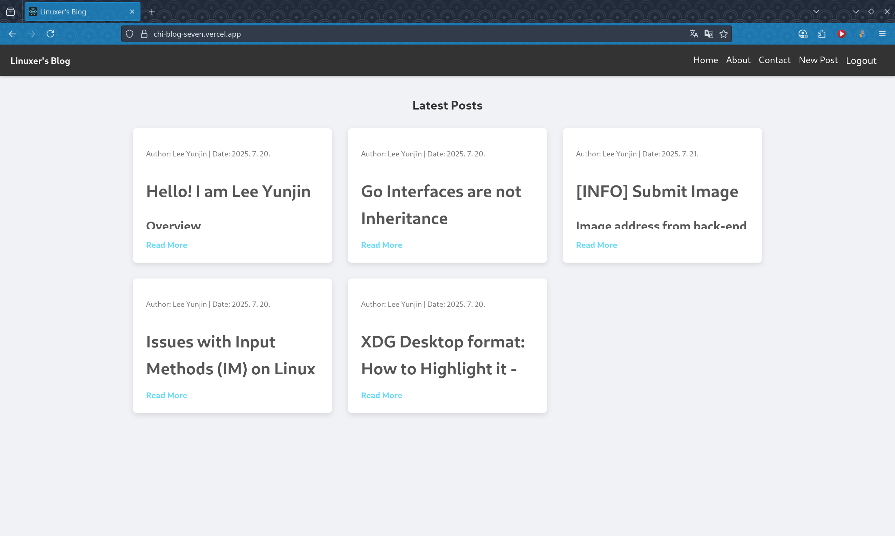
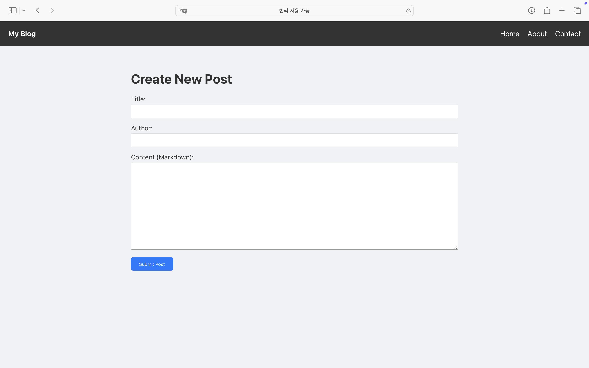

# Make Blog with Chi

- Login/Logout implemented
- Image attachment implemented
- New post implemented
- Post format is Markdown
- Code highlighter is included




## Configuration

The backend is configured via environment variables (all are optional; defaults preserve the previous hardcoded behavior):

| Env var | Default | Description |
| --- | --- | --- |
| `SERVER_ADDR` | `:8080` | Listen address for the HTTP(S) server |
| `DB_PATH` | `./auth.db` | Path to the SQLite database file |
| `STATIC_DIR` | `../blog-frontend/build` | Directory with the built frontend assets |
| `POSTS_DIR` | `./posts` | Directory containing blog post markdown files |
| `ASSETS_DIR` | `./posts/assets` | Directory for uploaded files |
| `ABOUT_MD` | `./about/about.md` | Markdown file for the about page |
| `CONTACT_MD` | `./contact/contact.md` | Markdown file for the contact page |
| `USE_HTTPS` | `false` | Set to `true` to serve HTTPS |
| `TLS_CERT_FILE` | `/etc/letsencrypt/live/chatter.pw/fullchain.pem` | TLS certificate chain |
| `TLS_KEY_FILE` | `/etc/letsencrypt/live/chatter.pw/privkey.pem` | TLS private key |
| `TLS_DOMAIN` | `chatter.pw` | Domain for ACME / autocert host whitelist |
| `ACME_CACHE_DIR` | `./cert-cache` | Local cache for ACME certificates |
| `HTTP_CHALLENGE_ADDR` | `:80` | Listen address for the ACME HTTP-01 challenge server |
| `ALLOWED_ORIGINS` | *(unset)* | Comma-separated CORS origins; when unset, no CORS middleware is added |
| `AUTH_SECRET` | *(random per start)* | HMAC secret for login tokens; set a persistent value or tokens are invalidated on every restart |

Example:

```bash
cd blog-backend
ALLOWED_ORIGINS="https://chatter.pw,http://localhost:3000" go run . run
```

## Docker

A multi-stage `Dockerfile` at the repo root builds the frontend, compiles the backend (CGO enabled for sqlite3), and packages both into a `debian:bookworm-slim` image.

Build:

```bash
docker build -t chi-blog .
# Optionally pin the frontend API URL at build time:
docker build --build-arg REACT_APP_API_URL=https://chatter.pw -t chi-blog .
```

Run:

```bash
docker run -p 8080:8080 -e ALLOWED_ORIGINS=https://chatter.pw,http://localhost:3000 chi-blog
```

### Docker Compose

The root `docker-compose.yml` is the recommended way to run the blog. It
persists all content (posts, uploaded assets, about/contact pages, `auth.db`)
in a named volume that is seeded from the image on first start:

```bash
docker compose up -d --build
docker compose exec chi-blog chi-blog init   # create the admin account
```

